# LumiSignals Analytics Architecture Documentation

## Table of Contents
1. [System Overview](#system-overview)
2. [Architecture Diagrams](#architecture-diagrams)
3. [Redis Tiered Storage Architecture](#redis-tiered-storage-architecture)
4. [Lambda Analytics API](#lambda-analytics-api)
5. [Trading Core Layer](#trading-core-layer)
6. [Data Flow](#data-flow)
7. [Deployment & Integration](#deployment--integration)
8. [Redis Setup & Configuration](#redis-setup--configuration)
9. [Troubleshooting](#troubleshooting)

---

## System Overview

The LumiSignals analytics system uses a **tiered data architecture** with Redis cluster storage and AWS Lambda for real-time signal analytics. This design optimizes performance, cost, and scalability by:

- **Hot/Warm/Cold Redis Storage**: Tiered data access for different latency requirements
- **Lambda Analytics API**: Serverless signal processing with trading core intelligence
- **Sharded Redis Cluster**: Distributed storage across 4 shards for 28 currency pairs
- **VPC Integration**: Secure network access between Lambda and Redis cluster

---

## Architecture Diagrams

### Overall System Architecture

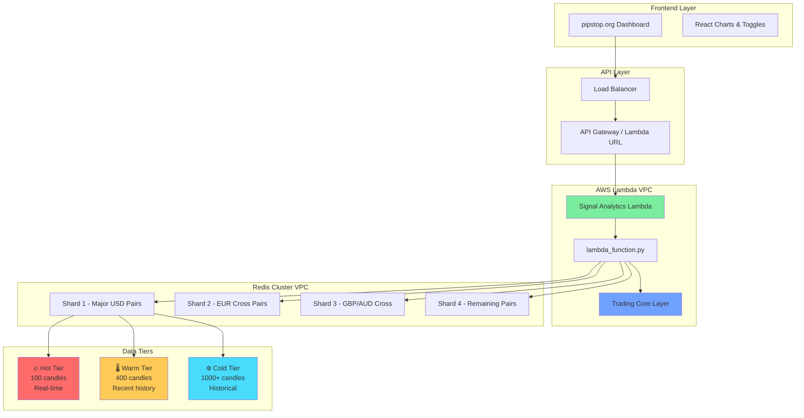
```mermaid
graph TB
    subgraph "Frontend Layer"
        FE[pipstop.org Dashboard]
        UI[React Charts & Toggles]
    end
    
    subgraph "API Layer"
        LB[Load Balancer]
        AGW[API Gateway / Lambda URL]
    end
    
    subgraph "AWS Lambda VPC"
        LA[Signal Analytics Lambda]
        LF[lambda_function.py]
        TC[Trading Core Layer]
    end
    
    subgraph "Redis Cluster VPC"
        direction TB
        RS1[Shard 1 - Major USD Pairs]
        RS2[Shard 2 - EUR Cross Pairs]
        RS3[Shard 3 - GBP/AUD Cross]
        RS4[Shard 4 - Remaining Pairs]
    end
    
    subgraph "Data Tiers"
        HOT[🔥 Hot Tier<br/>100 candles<br/>Real-time]
        WARM[🌡️ Warm Tier<br/>400 candles<br/>Recent history]
        COLD[❄️ Cold Tier<br/>1000+ candles<br/>Historical]
    end
    
    FE --> LB
    LB --> AGW
    AGW --> LA
    LA --> LF
    LF --> TC
    LF --> RS1
    LF --> RS2
    LF --> RS3
    LF --> RS4
    
    RS1 --> HOT
    RS1 --> WARM
    RS1 --> COLD
    
    style HOT fill:#ff6b6b
    style WARM fill:#feca57
    style COLD fill:#48dbfb
    style LA fill:#7bed9f
    style TC fill:#70a1ff
```

### Redis Sharding Strategy

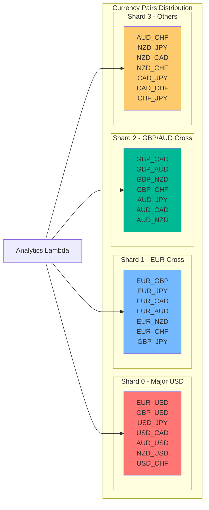
```mermaid
graph LR
    subgraph "Currency Pairs Distribution"
        subgraph "Shard 0 - Major USD"
            S0[EUR_USD<br/>GBP_USD<br/>USD_JPY<br/>USD_CAD<br/>AUD_USD<br/>NZD_USD<br/>USD_CHF]
        end
        
        subgraph "Shard 1 - EUR Cross"
            S1[EUR_GBP<br/>EUR_JPY<br/>EUR_CAD<br/>EUR_AUD<br/>EUR_NZD<br/>EUR_CHF<br/>GBP_JPY]
        end
        
        subgraph "Shard 2 - GBP/AUD Cross"
            S2[GBP_CAD<br/>GBP_AUD<br/>GBP_NZD<br/>GBP_CHF<br/>AUD_JPY<br/>AUD_CAD<br/>AUD_NZD]
        end
        
        subgraph "Shard 3 - Others"
            S3[AUD_CHF<br/>NZD_JPY<br/>NZD_CAD<br/>NZD_CHF<br/>CAD_JPY<br/>CAD_CHF<br/>CHF_JPY]
        end
    end
    
    Lambda[Analytics Lambda] --> S0
    Lambda --> S1
    Lambda --> S2
    Lambda --> S3
    
    style S0 fill:#ff7675
    style S1 fill:#74b9ff
    style S2 fill:#00b894
    style S3 fill:#fdcb6e
```

### Data Flow Architecture

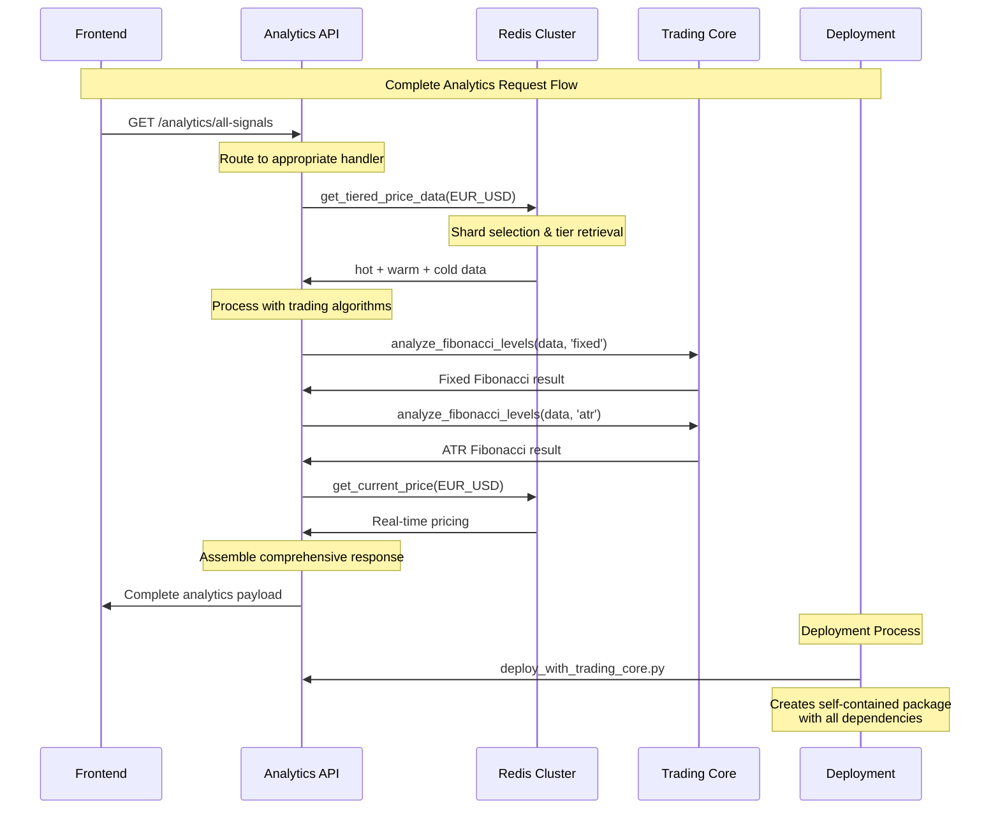
```mermaid
sequenceDiagram
    participant FE as Frontend
    participant API as Analytics API
    participant Redis as Redis Cluster
    participant Core as Trading Core
    participant Deploy as Deployment
    
    Note over FE,Deploy: Complete Analytics Request Flow
    
    FE->>API: GET /analytics/all-signals
    
    Note over API: Route to appropriate handler
    API->>Redis: get_tiered_price_data(EUR_USD)
    
    Note over Redis: Shard selection & tier retrieval
    Redis->>API: hot + warm + cold data
    
    Note over API: Process with trading algorithms
    API->>Core: analyze_fibonacci_levels(data, 'fixed')
    Core->>API: Fixed Fibonacci result
    
    API->>Core: analyze_fibonacci_levels(data, 'atr')
    Core->>API: ATR Fibonacci result
    
    API->>Redis: get_current_price(EUR_USD)
    Redis->>API: Real-time pricing
    
    Note over API: Assemble comprehensive response
    API->>FE: Complete analytics payload
    
    Note over Deploy: Deployment Process
    Deploy->>API: deploy_with_trading_core.py
    Note over Deploy: Creates self-contained package<br/>with all dependencies
```

### Trading Core Layer Structure

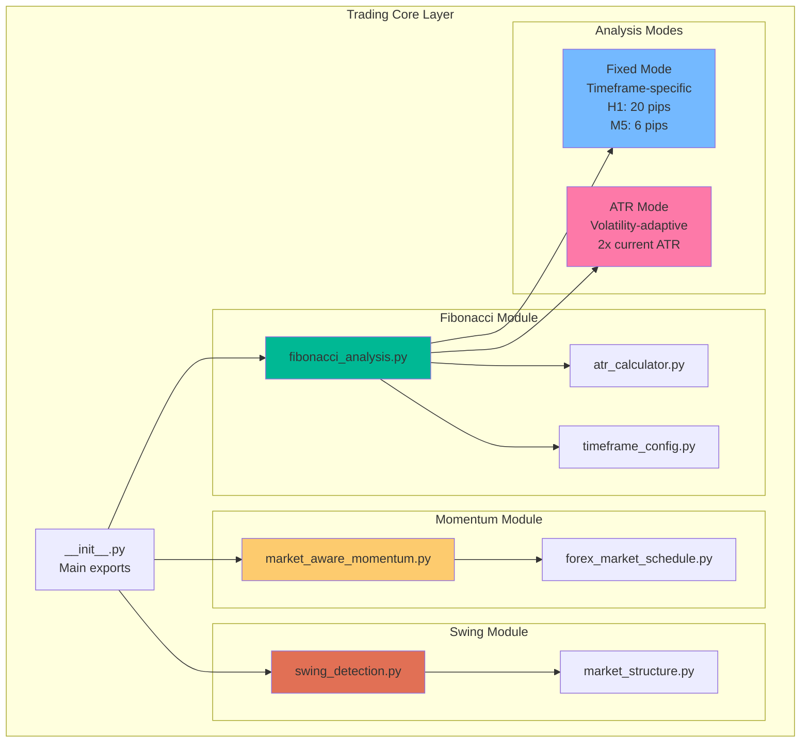
```mermaid
graph TB
    subgraph "Trading Core Layer"
        INIT[__init__.py<br/>Main exports]
        
        subgraph "Fibonacci Module"
            FB[fibonacci_analysis.py]
            ATR[atr_calculator.py]
            TFC[timeframe_config.py]
        end
        
        subgraph "Momentum Module"
            MOM[market_aware_momentum.py]
            SCHED[forex_market_schedule.py]
        end
        
        subgraph "Swing Module"
            SWING[swing_detection.py]
            STRUCT[market_structure.py]
        end
        
        subgraph "Analysis Modes"
            FIXED[Fixed Mode<br/>Timeframe-specific<br/>H1: 20 pips<br/>M5: 6 pips]
            ATRM[ATR Mode<br/>Volatility-adaptive<br/>2x current ATR]
        end
    end
    
    INIT --> FB
    INIT --> MOM
    INIT --> SWING
    
    FB --> ATR
    FB --> TFC
    FB --> FIXED
    FB --> ATRM
    
    MOM --> SCHED
    SWING --> STRUCT
    
    style FIXED fill:#74b9ff
    style ATRM fill:#fd79a8
    style FB fill:#00b894
    style MOM fill:#fdcb6e
    style SWING fill:#e17055
```

### Lambda Deployment Options

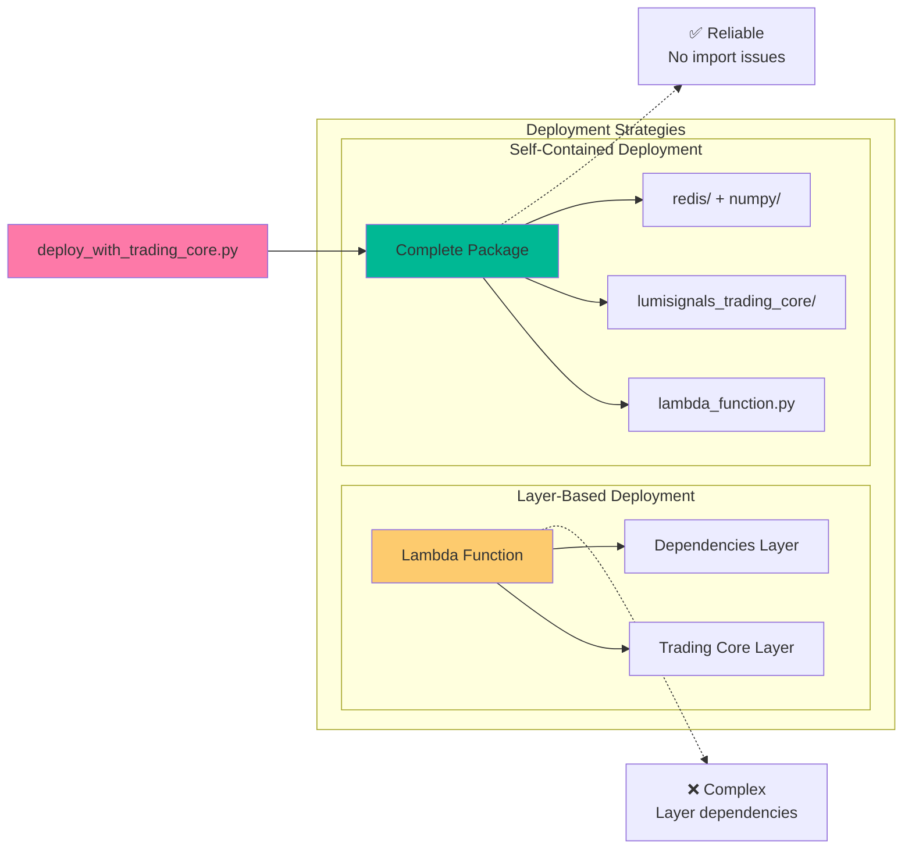
```mermaid
graph LR
    subgraph "Deployment Strategies"
        subgraph "Layer-Based Deployment"
            L1[Lambda Function]
            L2[Trading Core Layer]
            L3[Dependencies Layer]
            L1 --> L2
            L1 --> L3
        end
        
        subgraph "Self-Contained Deployment"
            SC1[Complete Package]
            SC2[lambda_function.py]
            SC3[lumisignals_trading_core/]
            SC4[redis/ + numpy/]
            SC1 --> SC2
            SC1 --> SC3
            SC1 --> SC4
        end
    end
    
    DEPLOY[deploy_with_trading_core.py] --> SC1
    
    Note1[✅ Reliable<br/>No import issues]
    Note2[❌ Complex<br/>Layer dependencies]
    
    SC1 -.-> Note1
    L1 -.-> Note2
    
    style SC1 fill:#00b894
    style L1 fill:#fdcb6e
    style DEPLOY fill:#fd79a8
```

---

## Redis Tiered Storage Architecture

### Overview
The Redis cluster uses a **3-tier storage model** to optimize performance and cost:

### Tier Structure

#### 🔥 **Hot Tier** - Ultra-low latency
- **Purpose**: Most recent 100 candlesticks for real-time analysis
- **Update Frequency**: Every 5 minutes for M5, hourly for H1
- **Redis Keys**: `market_data:{instrument}:{timeframe}:hot`
- **Access Pattern**: Constant read/write for live trading
- **Memory Priority**: Highest

#### 🌡️ **Warm Tier** - Medium latency
- **Purpose**: Extended historical data (400 candlesticks)
- **Update Frequency**: Hourly batch updates
- **Redis Keys**: `market_data:{instrument}:{timeframe}:warm`
- **Access Pattern**: Frequent reads for pattern analysis
- **Memory Priority**: Medium

#### ❄️ **Cold Tier** - Archival storage
- **Purpose**: Long-term historical data (1000+ candlesticks)
- **Update Frequency**: Daily batch updates
- **Redis Keys**: `market_data:{instrument}:{timeframe}:historical`
- **Access Pattern**: Occasional reads for backtesting
- **Memory Priority**: Lowest (can be evicted)

### Sharding Strategy

The Redis cluster uses **4 shards** with currency pair distribution:

```javascript
// Shard mapping for optimal load distribution
const SHARD_MAPPING = {
    // Shard 0: Major USD pairs (highest volume)
    "EUR_USD": 0, "GBP_USD": 0, "USD_JPY": 0, "USD_CAD": 0, 
    "AUD_USD": 0, "NZD_USD": 0, "USD_CHF": 0,
    
    // Shard 1: EUR cross pairs + GBP_JPY
    "EUR_GBP": 1, "EUR_JPY": 1, "EUR_CAD": 1, "EUR_AUD": 1, 
    "EUR_NZD": 1, "EUR_CHF": 1, "GBP_JPY": 1,
    
    // Shard 2: GBP and AUD cross pairs
    "GBP_CAD": 2, "GBP_AUD": 2, "GBP_NZD": 2, "GBP_CHF": 2,
    "AUD_JPY": 2, "AUD_CAD": 2, "AUD_NZD": 2,
    
    // Shard 3: Remaining cross pairs
    "AUD_CHF": 3, "NZD_JPY": 3, "NZD_CAD": 3, "NZD_CHF": 3,
    "CAD_JPY": 3, "CAD_CHF": 3, "CHF_JPY": 3
};
```

### Redis Node Configuration

```bash
# Production Redis Cluster Endpoints
REDIS_NODES = [
    "lumisignals-main-vpc-trading-shard-1-001.wo9apa.0001.use1.cache.amazonaws.com:6379",
    "lumisignals-main-vpc-trading-shard-2-001.wo9apa.0001.use1.cache.amazonaws.com:6379", 
    "lumisignals-main-vpc-trading-shard-3-001.wo9apa.0001.use1.cache.amazonaws.com:6379",
    "lumisignals-main-vpc-trading-shard-4-001.wo9apa.0001.use1.cache.amazonaws.com:6379"
]
```

---

## Lambda Analytics API

### Core Function: `lambda_function.py`

Located at: `infrastructure/lambda/signal-analytics-api/lambda_function.py`

#### **Primary Purpose**
Serves as the **central analytics engine** AND **price data provider** that:
- **Centralized Data Retrieval**: Fetches price data ONCE per request
- **Data Distribution**: Provides same price dataset to all analytics functions
- **Signal Processing**: Uses trading core algorithms for analysis
- **API Management**: Handles CORS, routing, and response assembly

#### **Key Endpoints**

1. **`GET /analytics/all-signals`**
   - Returns analytics for all 28 currency pairs
   - Uses tiered data retrieval for optimal performance
   - Includes Fibonacci, momentum, sentiment analysis

2. **`GET /analytics/momentum/{instrument}`**
   - Detailed momentum analysis for specific pair
   - Market-aware calculations using trading hours

3. **`GET /analytics/consensus/{instrument}`**
   - Trading consensus signals
   - Confidence scoring and alignment analysis

#### **🔑 Centralized Price Data Retrieval**

This is the **KEY INNOVATION** - price data is fetched ONCE and distributed to all analytics:

```python
def get_tiered_price_data(instrument: str, timeframe: str = 'H1') -> Dict[str, Any]:
    """
    Centralized data retrieval - THE SINGLE SOURCE OF TRUTH for all analytics
    """
    # Get data from all tiers
    hot_data = get_redis_candles(f"market_data:{instrument}:{timeframe}:hot", instrument)
    warm_data = get_redis_candles(f"market_data:{instrument}:{timeframe}:warm", instrument) 
    cold_data = get_redis_candles(f"market_data:{instrument}:{timeframe}:historical", instrument)
    
    # Combine hot + warm for complete dataset (500 candles total)
    combined_data = hot_data + warm_data
    
    # Fallback to cold tier if insufficient data
    if len(combined_data) < 100:
        combined_data = cold_data
    
    return {
        'hot': hot_data,           # Real-time data
        'warm': warm_data,         # Recent history  
        'cold': cold_data,         # Deep history
        'combined': combined_data, # Optimal dataset for analytics
        'current_price': get_current_price(instrument),
        'instrument': instrument,
        'timeframe': timeframe,
        'total_candles': len(combined_data)
    }
```

#### **📊 How Analytics Functions Use Shared Price Data**

```python
def generate_pair_analytics(instrument: str, timeframe: str = 'H1'):
    """Generate comprehensive analytics using centralized data"""
    
    # STEP 1: GET ALL DATA ONCE - This is the key improvement
    price_data = get_tiered_price_data(instrument, timeframe)
    
    # STEP 2: RUN ALL ANALYTICS WITH SAME DATA
    fibonacci_data = analyze_fibonacci_tiered(price_data)  # Uses price_data
    swing_data = analyze_swing_points(price_data)         # Uses same price_data
    # Future analytics:
    # momentum_data = analyze_momentum_tiered(price_data)
    # sentiment_data = analyze_sentiment_tiered(price_data)
    
    # STEP 3: Return combined analytics
    return {
        'fibonacci': fibonacci_data,
        'swing': swing_data,
        # All analytics use the SAME price dataset
    }
```

### Why Lambda for Analytics?

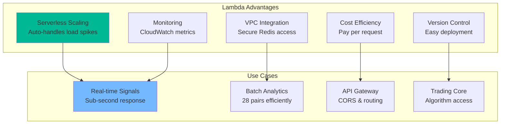
```mermaid
graph TB
    subgraph "Lambda Advantages"
        A1[Serverless Scaling<br/>Auto-handles load spikes]
        A2[VPC Integration<br/>Secure Redis access]
        A3[Cost Efficiency<br/>Pay per request]
        A4[Version Control<br/>Easy deployment]
        A5[Monitoring<br/>CloudWatch metrics]
    end
    
    subgraph "Use Cases"
        U1[Real-time Signals<br/>Sub-second response]
        U2[Batch Analytics<br/>28 pairs efficiently]
        U3[API Gateway<br/>CORS & routing]
        U4[Trading Core<br/>Algorithm access]
    end
    
    A1 --> U1
    A2 --> U2
    A3 --> U3
    A4 --> U4
    A5 --> U1
    
    style A1 fill:#00b894
    style U1 fill:#74b9ff
```

---

## Trading Core Layer

### Purpose: `lumisignals_trading_core`

The trading core layer provides **sophisticated market analysis algorithms** as a reusable Lambda layer.

#### **Core Modules**

1. **Fibonacci Analysis** (`fibonacci/`)
   - **Fixed Mode**: Timeframe-specific pip thresholds
   - **ATR Mode**: Volatility-adaptive dynamic thresholds
   - **Swing Detection**: Advanced swing point identification

2. **Momentum Analysis** (`momentum/`)
   - **Market-aware calculations**: Respects trading hours
   - **Multi-timeframe analysis**: 5m, 15m, 1h, 4h, daily
   - **Forex market schedule**: Session overlap detection

3. **Swing Detection** (`swing/`)
   - **Enhanced algorithms**: Adaptive threshold calculation
   - **Market structure analysis**: Trend identification
   - **Volume confirmation**: Strength validation

#### **Integration Pattern**

```python
# Import trading core components
try:
    from lumisignals_trading_core.fibonacci import analyze_fibonacci_levels
    from lumisignals_trading_core.momentum import MarketAwareMomentumCalculator
    from lumisignals_trading_core.swing import analyze_swing_structure
    
    # Use real analysis
    fibonacci_data = analyze_fibonacci_levels(instrument, current_price, candles, mode='fixed')
    momentum_data = MarketAwareMomentumCalculator.calculate(candles)
    
except ImportError:
    # Fallback to basic analysis
    logger.warning("Trading core layer not available, using fallback")
```

### Layer Benefits

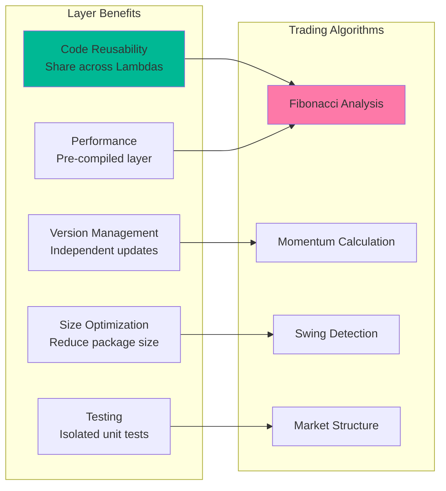
```mermaid
graph LR
    subgraph "Layer Benefits"
        B1[Code Reusability<br/>Share across Lambdas]
        B2[Version Management<br/>Independent updates]
        B3[Size Optimization<br/>Reduce package size]
        B4[Testing<br/>Isolated unit tests]
        B5[Performance<br/>Pre-compiled layer]
    end
    
    subgraph "Trading Algorithms"
        T1[Fibonacci Analysis]
        T2[Momentum Calculation]
        T3[Swing Detection]
        T4[Market Structure]
    end
    
    B1 --> T1
    B2 --> T2
    B3 --> T3
    B4 --> T4
    B5 --> T1
    
    style B1 fill:#00b894
    style T1 fill:#fd79a8
```

---

## Data Flow

### 🔑 Centralized Price Data Distribution

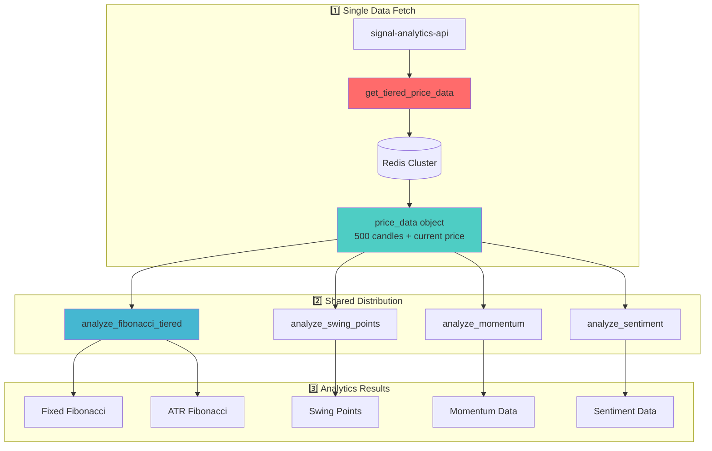
```mermaid
graph TB
    subgraph "1️⃣ Single Data Fetch"
        LAMBDA[signal-analytics-api]
        GETDATA[get_tiered_price_data]
        REDIS[(Redis Cluster)]
        
        LAMBDA --> GETDATA
        GETDATA --> REDIS
        REDIS --> PRICEDATA[price_data object<br/>500 candles + current price]
    end
    
    subgraph "2️⃣ Shared Distribution"
        PRICEDATA --> FIB[analyze_fibonacci_tiered]
        PRICEDATA --> SWING[analyze_swing_points]
        PRICEDATA --> MOM[analyze_momentum]
        PRICEDATA --> SENT[analyze_sentiment]
    end
    
    subgraph "3️⃣ Analytics Results"
        FIB --> FIXED[Fixed Fibonacci]
        FIB --> ATR[ATR Fibonacci]
        SWING --> SWINGPTS[Swing Points]
        MOM --> MOMENTUM[Momentum Data]
        SENT --> SENTIMENT[Sentiment Data]
    end
    
    style GETDATA fill:#ff6b6b
    style PRICEDATA fill:#4ecdc4
    style FIB fill:#45b7d1
```

### Complete Analytics Request Flow

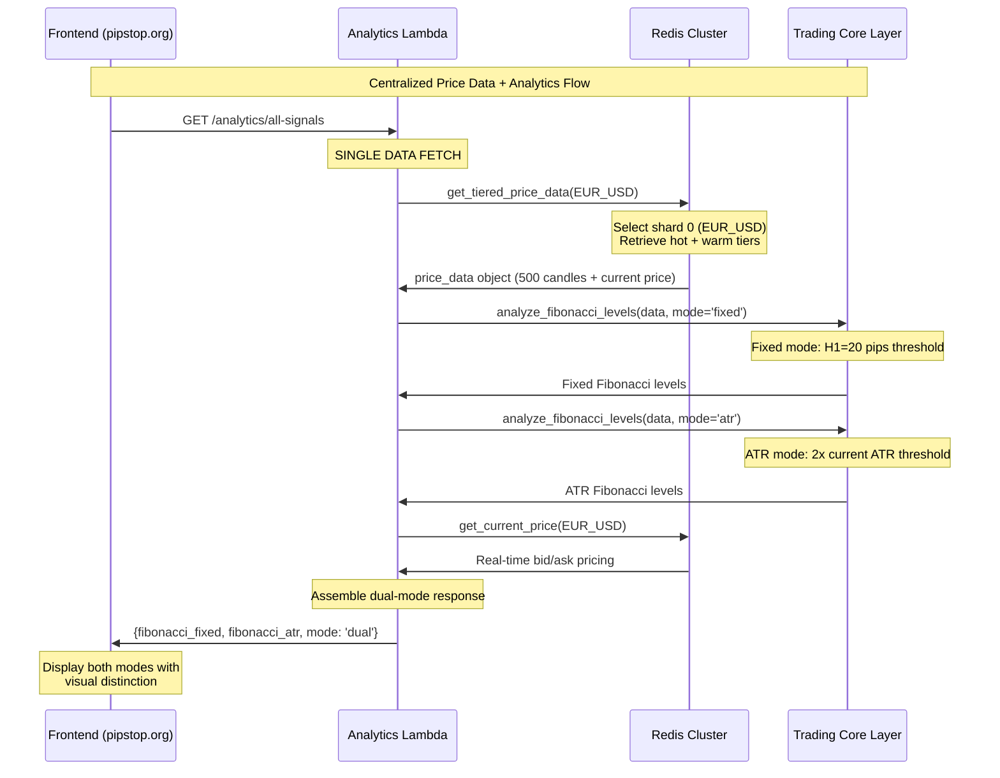
```mermaid
sequenceDiagram
    participant F as Frontend (pipstop.org)
    participant A as Analytics Lambda
    participant R as Redis Cluster
    participant T as Trading Core Layer
    
    Note over F,T: Centralized Price Data + Analytics Flow
    
    F->>A: GET /analytics/all-signals
    
    Note over A: SINGLE DATA FETCH
    A->>R: get_tiered_price_data(EUR_USD)
    Note over R: Select shard 0 (EUR_USD)<br/>Retrieve hot + warm tiers
    R->>A: price_data object (500 candles + current price)
    
    A->>T: analyze_fibonacci_levels(data, mode='fixed')
    Note over T: Fixed mode: H1=20 pips threshold
    T->>A: Fixed Fibonacci levels
    
    A->>T: analyze_fibonacci_levels(data, mode='atr')
    Note over T: ATR mode: 2x current ATR threshold
    T->>A: ATR Fibonacci levels
    
    A->>R: get_current_price(EUR_USD)
    R->>A: Real-time bid/ask pricing
    
    Note over A: Assemble dual-mode response
    A->>F: {fibonacci_fixed, fibonacci_atr, mode: 'dual'}
    
    Note over F: Display both modes with<br/>visual distinction
```

### Data Lifecycle

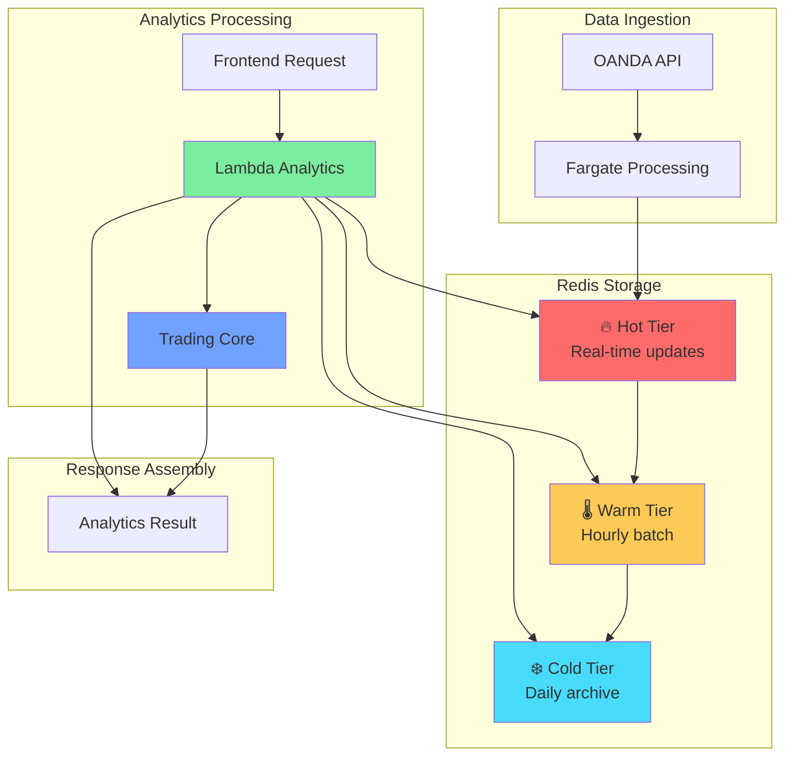
```mermaid
graph TB
    subgraph "Data Ingestion"
        OANDA[OANDA API]
        FARGATE[Fargate Processing]
        OANDA --> FARGATE
    end
    
    subgraph "Redis Storage"
        HOT2[🔥 Hot Tier<br/>Real-time updates]
        WARM2[🌡️ Warm Tier<br/>Hourly batch]
        COLD2[❄️ Cold Tier<br/>Daily archive]
        
        FARGATE --> HOT2
        HOT2 --> WARM2
        WARM2 --> COLD2
    end
    
    subgraph "Analytics Processing"
        REQUEST[Frontend Request]
        LAMBDA[Lambda Analytics]
        CORE[Trading Core]
        
        REQUEST --> LAMBDA
        LAMBDA --> HOT2
        LAMBDA --> WARM2
        LAMBDA --> COLD2
        LAMBDA --> CORE
    end
    
    subgraph "Response Assembly"
        RESULT[Analytics Result]
        CORE --> RESULT
        LAMBDA --> RESULT
    end
    
    style HOT2 fill:#ff6b6b
    style WARM2 fill:#feca57
    style COLD2 fill:#48dbfb
    style LAMBDA fill:#7bed9f
    style CORE fill:#70a1ff
```

---

## Deployment & Integration

### Deployment Script: `deploy_with_trading_core.py`

Located at: `infrastructure/lambda/signal-analytics-api/deploy_with_trading_core.py`

#### **When to Use - Decision Tree**

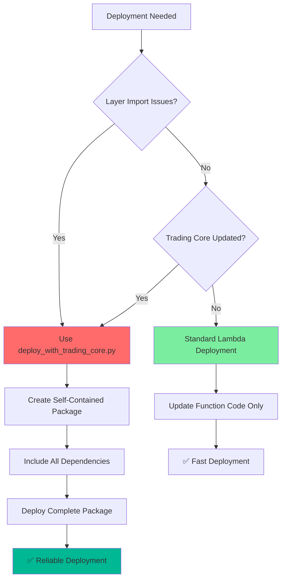
```mermaid
graph TD
    START[Deployment Needed] --> CHECK{Layer Import Issues?}
    CHECK -->|Yes| SELF[Use deploy_with_trading_core.py]
    CHECK -->|No| LAYER{Trading Core Updated?}
    LAYER -->|Yes| SELF
    LAYER -->|No| NORMAL[Standard Lambda Deployment]
    
    SELF --> PACKAGE[Create Self-Contained Package]
    PACKAGE --> INCLUDE[Include All Dependencies]
    INCLUDE --> DEPLOY[Deploy Complete Package]
    
    NORMAL --> UPDATE[Update Function Code Only]
    
    DEPLOY --> SUCCESS[✅ Reliable Deployment]
    UPDATE --> SUCCESS2[✅ Fast Deployment]
    
    style SELF fill:#ff6b6b
    style NORMAL fill:#7bed9f
    style SUCCESS fill:#00b894
```

#### **Deployment Process**

```python
def create_deployment_package():
    """Create a complete deployment package with trading core modules"""
    
    # 1. Create package directory
    package_dir = "complete_package"
    
    # 2. Copy main Lambda function
    shutil.copy2("lambda_function.py", package_dir)
    
    # 3. Copy dependencies
    shutil.copytree("redis", os.path.join(package_dir, "redis"))
    shutil.copytree("numpy", os.path.join(package_dir, "numpy"))
    
    # 4. Copy trading core modules (CRITICAL)
    shutil.copytree("lumisignals_trading_core", os.path.join(package_dir, "lumisignals_trading_core"))
    
    # 5. Create deployment ZIP
    with zipfile.ZipFile(zip_path, 'w', zipfile.ZIP_DEFLATED) as zipf:
        # Package all files
    
    # 6. Deploy to AWS Lambda
    lambda_client.update_function_code(FunctionName=function_name, ZipFile=zip_content)
```

### Layer vs Self-Contained Comparison

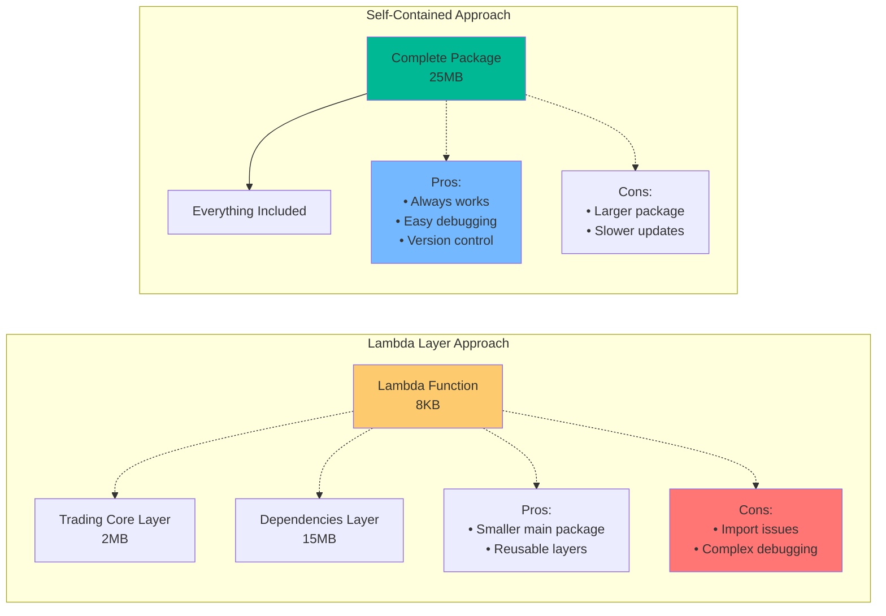
```mermaid
graph LR
    subgraph "Lambda Layer Approach"
        L1[Lambda Function<br/>8KB]
        L2[Trading Core Layer<br/>2MB]
        L3[Dependencies Layer<br/>15MB]
        
        L1 -.-> L2
        L1 -.-> L3
        
        LP[Pros:<br/>• Smaller main package<br/>• Reusable layers]
        LC[Cons:<br/>• Import issues<br/>• Complex debugging]
    end
    
    subgraph "Self-Contained Approach"
        S1[Complete Package<br/>25MB]
        S2[Everything Included]
        
        S1 --> S2
        
        SP[Pros:<br/>• Always works<br/>• Easy debugging<br/>• Version control]
        SC[Cons:<br/>• Larger package<br/>• Slower updates]
    end
    
    L1 -.-> LP
    L1 -.-> LC
    S1 -.-> SP
    S1 -.-> SC
    
    style S1 fill:#00b894
    style L1 fill:#fdcb6e
    style SP fill:#74b9ff
    style LC fill:#ff7675
```

---

## Redis Setup & Configuration

### VPC Configuration Requirements

#### **Network Architecture**

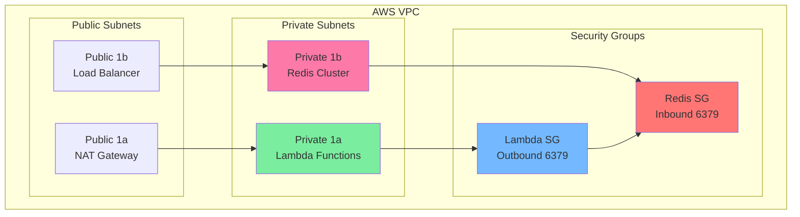
```mermaid
graph TB
    subgraph "AWS VPC"
        subgraph "Public Subnets"
            PUB1[Public 1a<br/>NAT Gateway]
            PUB2[Public 1b<br/>Load Balancer]
        end
        
        subgraph "Private Subnets"
            PRIV1[Private 1a<br/>Lambda Functions]
            PRIV2[Private 1b<br/>Redis Cluster]
        end
        
        subgraph "Security Groups"
            SG1[Lambda SG<br/>Outbound 6379]
            SG2[Redis SG<br/>Inbound 6379]
        end
    end
    
    PUB1 --> PRIV1
    PUB2 --> PRIV2
    PRIV1 --> SG1
    PRIV2 --> SG2
    SG1 --> SG2
    
    style PRIV1 fill:#7bed9f
    style PRIV2 fill:#fd79a8
    style SG1 fill:#74b9ff
    style SG2 fill:#ff7675
```

#### **Redis Client Configuration**

```python
# Persistent connections with retry logic
redis_connections = {}

def init_redis_connections():
    """Initialize Redis connections to all shards"""
    for i, node in enumerate(REDIS_NODES):
        host, port = node.split(':')
        redis_connections[i] = redis.Redis(
            host=host,
            port=int(port),
            decode_responses=False,  # Handle JSON parsing manually
            socket_connect_timeout=30,
            socket_timeout=30,
            retry_on_timeout=True,
            health_check_interval=30
        )
```

### Data Structure in Redis

#### **Key Naming Convention**
```bash
# Pattern: market_data:{instrument}:{timeframe}:{tier}
market_data:EUR_USD:H1:hot        # Hot tier data
market_data:EUR_USD:H1:warm       # Warm tier data  
market_data:EUR_USD:H1:historical # Cold tier data

# Current pricing
market_data:EUR_USD:pricing:current
```

#### **Data Format**
```json
// Candlestick data (stored as JSON strings in Redis LIST)
{
  "time": "2025-09-17T15:00:00.000Z",
  "open": 1.09234,
  "high": 1.09456,
  "low": 1.09123,
  "close": 1.09345,
  "volume": 12345
}

// Current pricing
{
  "bid": 1.09334,
  "ask": 1.09346,
  "timestamp": "2025-09-17T15:05:23.456Z"
}
```

---

## Troubleshooting

### Common Issues & Solutions

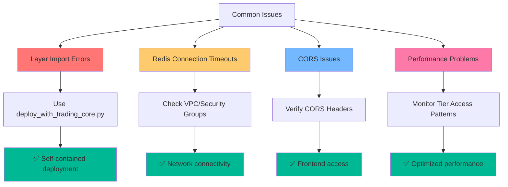
```mermaid
graph TD
    ISSUE[Common Issues] --> I1[Layer Import Errors]
    ISSUE --> I2[Redis Connection Timeouts]
    ISSUE --> I3[CORS Issues]
    ISSUE --> I4[Performance Problems]
    
    I1 --> S1[Use deploy_with_trading_core.py]
    I2 --> S2[Check VPC/Security Groups]
    I3 --> S3[Verify CORS Headers]
    I4 --> S4[Monitor Tier Access Patterns]
    
    S1 --> R1[✅ Self-contained deployment]
    S2 --> R2[✅ Network connectivity]
    S3 --> R3[✅ Frontend access]
    S4 --> R4[✅ Optimized performance]
    
    style I1 fill:#ff7675
    style I2 fill:#fdcb6e
    style I3 fill:#74b9ff
    style I4 fill:#fd79a8
    style R1 fill:#00b894
    style R2 fill:#00b894
    style R3 fill:#00b894
    style R4 fill:#00b894
```

### Monitoring & Health Checks

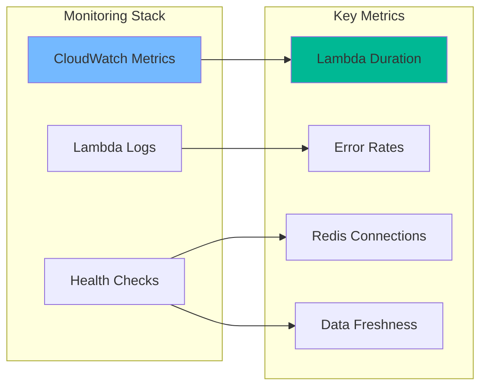
```mermaid
graph LR
    subgraph "Monitoring Stack"
        CW[CloudWatch Metrics]
        LOGS[Lambda Logs]
        HEALTH[Health Checks]
    end
    
    subgraph "Key Metrics"
        M1[Lambda Duration]
        M2[Error Rates]
        M3[Redis Connections]
        M4[Data Freshness]
    end
    
    CW --> M1
    LOGS --> M2
    HEALTH --> M3
    HEALTH --> M4
    
    style CW fill:#74b9ff
    style M1 fill:#00b894
```

---

## Best Practices

### Development Workflow

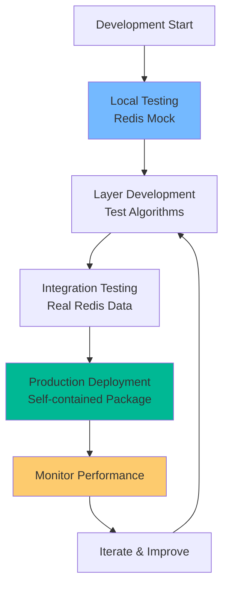
```mermaid
graph TB
    START[Development Start] --> LOCAL[Local Testing<br/>Redis Mock]
    LOCAL --> LAYER[Layer Development<br/>Test Algorithms]
    LAYER --> INTEGRATION[Integration Testing<br/>Real Redis Data]
    INTEGRATION --> DEPLOY[Production Deployment<br/>Self-contained Package]
    
    DEPLOY --> MONITOR[Monitor Performance]
    MONITOR --> ITERATE[Iterate & Improve]
    ITERATE --> LAYER
    
    style LOCAL fill:#74b9ff
    style DEPLOY fill:#00b894
    style MONITOR fill:#fdcb6e
```

### Performance Optimization

1. **Tiered Access**: Prefer hot tier for real-time data
2. **Connection Reuse**: Maintain persistent Redis connections
3. **Batch Processing**: Process multiple pairs efficiently
4. **Caching**: Cache frequently accessed data

---

## Conclusion

The LumiSignals analytics architecture provides a robust, scalable foundation for real-time trading signal generation. The tiered Redis storage, combined with Lambda's serverless processing and the trading core layer's sophisticated algorithms, delivers:

- **Sub-second response times** for real-time analytics
- **Cost-effective scaling** based on actual usage  
- **Sophisticated analysis** using proven trading algorithms
- **Reliable deployment** with multiple deployment strategies
- **Comprehensive monitoring** and debugging capabilities

This architecture successfully handles 28 currency pairs with multiple timeframes, providing the analytical foundation for the pipstop.org trading dashboard.

### Key Architecture Benefits

#### **🔑 Centralized Price Data Architecture Benefits**

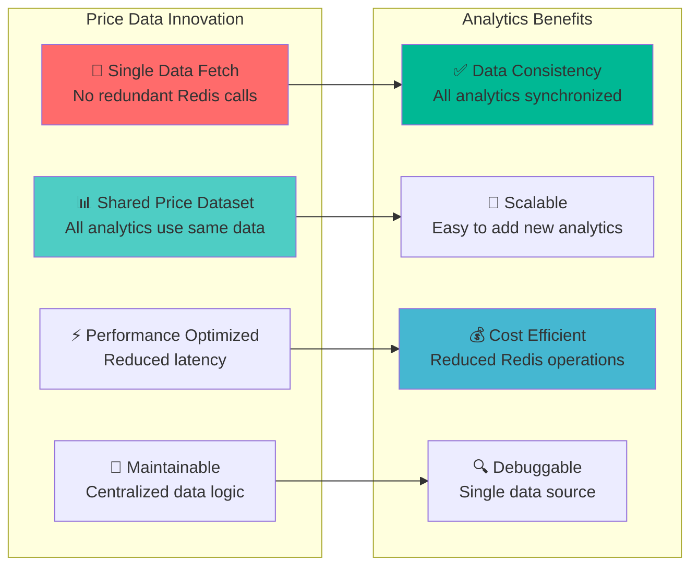
```mermaid
graph LR
    subgraph "Price Data Innovation"
        P1[🔑 Single Data Fetch<br/>No redundant Redis calls]
        P2[📊 Shared Price Dataset<br/>All analytics use same data]
        P3[⚡ Performance Optimized<br/>Reduced latency]
        P4[🔧 Maintainable<br/>Centralized data logic]
    end
    
    subgraph "Analytics Benefits"
        A1[✅ Data Consistency<br/>All analytics synchronized]
        A2[🚀 Scalable<br/>Easy to add new analytics]
        A3[💰 Cost Efficient<br/>Reduced Redis operations]
        A4[🔍 Debuggable<br/>Single data source]
    end
    
    P1 --> A1
    P2 --> A2
    P3 --> A3
    P4 --> A4
    
    style P1 fill:#ff6b6b
    style P2 fill:#4ecdc4
    style A1 fill:#00b894
    style A3 fill:#45b7d1
```

### Overall System Benefits

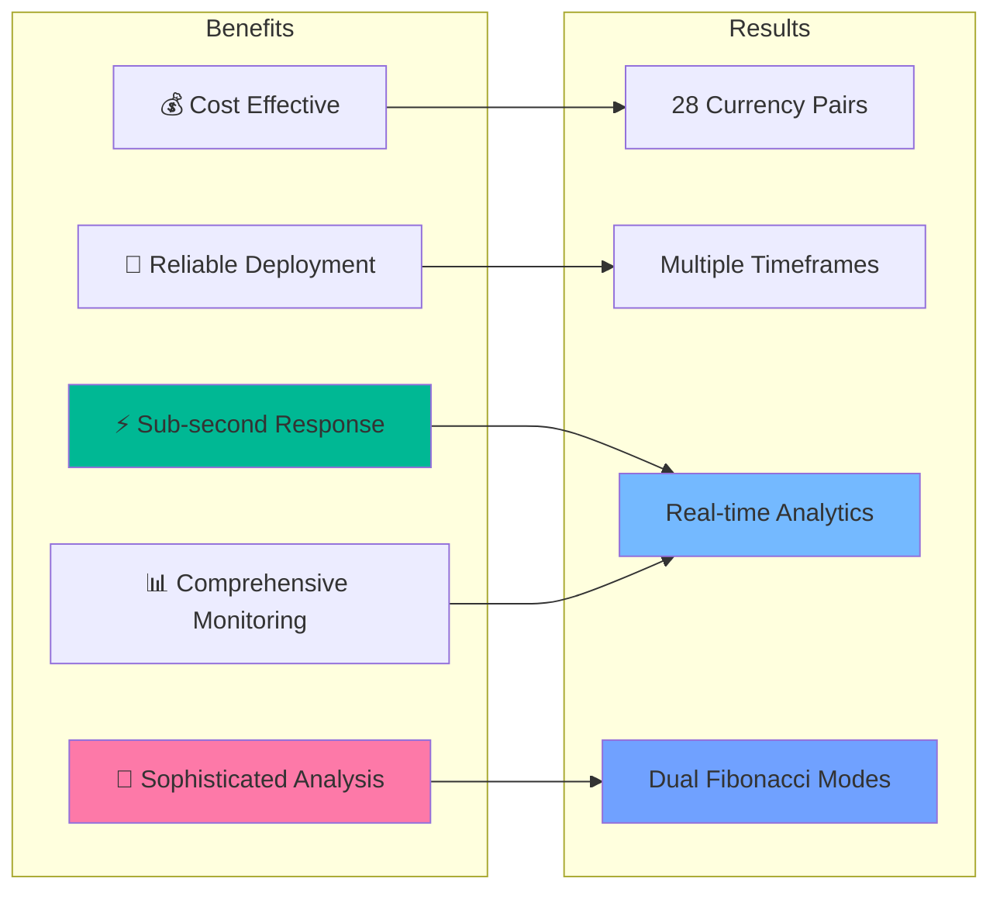
```mermaid
graph LR
    subgraph "Benefits"
        B1[⚡ Sub-second Response]
        B2[💰 Cost Effective]
        B3[🧠 Sophisticated Analysis]
        B4[🔧 Reliable Deployment]
        B5[📊 Comprehensive Monitoring]
    end
    
    subgraph "Results"
        R1[28 Currency Pairs]
        R2[Multiple Timeframes]
        R3[Real-time Analytics]
        R4[Dual Fibonacci Modes]
    end
    
    B1 --> R3
    B2 --> R1
    B3 --> R4
    B4 --> R2
    B5 --> R3
    
    style B1 fill:#00b894
    style B3 fill:#fd79a8
    style R3 fill:#74b9ff
    style R4 fill:#70a1ff
```