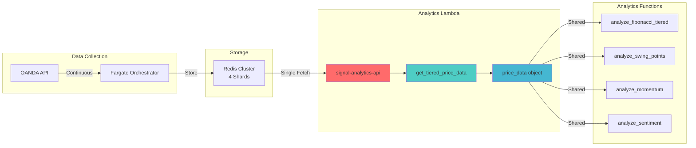

# LumiSignals Lambda Function Registry
*Comprehensive documentation of all Lambda functions in the LumiSignals trading system*

**Version**: 2.1  
**Last Updated**: September 19, 2025  
**Total Functions**: 32 Lambda functions  
**System Status**: ✅ Analytics & Data Infrastructure Operational | ✅ Real Fibonacci Data Deployed | ⚠️ Trading Strategy Investigation Required

---

## 🎯 **Function Categories**

### **🚀 CRITICAL: Automated Trading Strategies** 
*These functions should be generating trades but haven't for several weeks*

| Function Name | Schedule | Strategy Type | Last Modified | Runtime | Status |
|---------------|----------|---------------|---------------|---------|--------|
| `lumisignals-penny_curve_pc_h1_all_dual_limit_20sl` | `rate(1 hour)` | Penny Level H1 | 2025-07-30 | Python 3.11 | ⚠️ INVESTIGATE |
| `lumisignals-penny_curve_pc_h1_all_dual_limit_20sl_v2` | `rate(1 hour)` | Penny Level H1 v2 | 2025-07-30 | Python 3.11 | ⚠️ INVESTIGATE |
| `lumisignals-penny_curve_pc_m15_market_dual_20sl` | `rate(15 minutes)` | Penny Level M15 | 2025-07-30 | Python 3.11 | ⚠️ INVESTIGATE |
| `lumisignals-penny_curve_ren_pc_h1_all_001` | `rate(1 hour)` | Renaissance Penny H1 | 2025-07-30 | Python 3.11 | ⚠️ INVESTIGATE |
| `lumisignals-penny_curve_ren_pc_h1_all_dual_limit` | `rate(1 hour)` | Renaissance Penny Dual | 2025-07-30 | Python 3.11 | ⚠️ INVESTIGATE |
| `lumisignals-penny_curve_ren_pc_m5_all_001` | `rate(5 minutes)` | Renaissance Penny M5 | 2025-07-30 | Python 3.11 | ⚠️ INVESTIGATE |

### **🔷 Dime Level Trading Strategies**

| Function Name | Schedule | Strategy Type | Last Modified | Runtime | Status |
|---------------|----------|---------------|---------------|---------|--------|
| `lumisignals-dime_curve_dc_h1_all_dual_limit_100sl` | `rate(1 hour)` | Dime Level H1 | 2025-08-07 | Python 3.11 | ✅ ACTIVE |
| `lumisignals-dime_curve_ren_dc_h4_all_001` | `rate(4 hours)` | Renaissance Dime H4 | 2025-07-30 | Python 3.11 | ✅ ACTIVE |
| `lumisignals-str1_Dime_Curve_Strategies` | `rate(1 hour)` | Str1 Dime Curve | 2025-07-30 | Python 3.11 | ✅ ACTIVE |
| `lumisignals-Dime_Curve_Strategies_1` | `rate(1 hour)` | Dime Curve Alt | 2025-07-30 | Python 3.11 | ✅ ACTIVE |
| `lumisignals-str1_Dime_Curve_Butter_Strategy` | `rate(1 hour)` | Str1 Dime Butter | 2025-07-30 | Python 3.11 | ✅ ACTIVE |

### **🟡 Quarter Level Trading Strategies**

| Function Name | Schedule | Strategy Type | Last Modified | Runtime | Status |
|---------------|----------|---------------|---------------|---------|--------|
| `lumisignals-Quarter_Curve_Butter_1` | `rate(30 minutes)` | Quarter Curve Butter | 2025-07-30 | Python 3.11 | ✅ ACTIVE |
| `lumisignals-quarter_curve_qc_h1_all_dual_limit_75sl` | `rate(1 hour)` | Quarter Level H1 | 2025-07-30 | Python 3.11 | ✅ ACTIVE |
| `lumisignals-quarter_curve_ren_qc_h2_all_001` | `rate(2 hours)` | Renaissance Quarter H2 | 2025-07-30 | Python 3.11 | ✅ ACTIVE |
| `lumisignals-str1_Quarter_Curve_Butter_Strategy` | `rate(1 hour)` | Str1 Quarter Butter | 2025-07-30 | Python 3.11 | ✅ ACTIVE |

### **🔥 High Frequency & Zone Strategies**

| Function Name | Schedule | Strategy Type | Last Modified | Runtime | Status |
|---------------|----------|---------------|---------------|---------|--------|
| `lumisignals-str1_high_frequency_zone_strategy` | `rate(5 minutes)` | High Frequency Zone | 2025-07-30 | Python 3.11 | ✅ ACTIVE |
| `lumisignals-str1_Penny_Curve_Strategy` | `rate(1 hour)` | Str1 Penny Curve | 2025-07-30 | Python 3.11 | ✅ ACTIVE |

---

## 📊 **Data Infrastructure Functions**

### **🔥 NEW: Analytics & Signal Processing Hub**
| Function Name | Purpose | Runtime | Last Updated | Function URL |
|---------------|---------|---------|--------------|--------------|
| `lumisignals-signal-analytics-api` | **Central Analytics Hub + Price Data Provider** | Python 3.11 | **2025-09-19** ✅ | `hqsiypravhxr5lhhkajvstmnpi0mxckg.lambda-url.us-east-1.on.aws` |

**🎯 KEY ROLE: Centralized Price Data Provider**
- 🔑 **Single Data Fetch**: Retrieves price data ONCE per request via `get_tiered_price_data()`
- 📊 **Distributes to All Analytics**: Same price dataset used by Fibonacci, Swing, Momentum, etc.
- ⚡ **Performance Optimized**: No redundant Redis calls across analytics functions

**Core Features - UPDATED 2025-09-19**:
- ✨ **Dual Fibonacci Analysis**: Fixed mode (timeframe-specific) + ATR mode (volatility-adaptive)
- 📊 **Redis Tiered Storage Access**: Hot (100) + Warm (400) + Cold (1000+) candles
- 🎯 **Multi-timeframe Support**: H1, M5, M15, M30, D1
- 🔗 **VPC Integration**: Secure access to Redis cluster
- 📈 **Enhanced Swing Detection**: Advanced market structure analysis
- 🔄 **Unified Analytics Pipeline**: All analytics use same `price_data` object
- 🔥 **FIXED: NumPy Dependency Issue**: Now uses binary wheels (NumPy 1.26.4)
- ✅ **Real Fibonacci Data**: Both modes return actual pivot points (`has_fallback: false`)
- 🎯 **Tuned Parameters**: H1=15 pips, M5=4 pips, ATR=1.5x multiplier

### **Real-Time Data Collection**
| Function Name | Purpose | Schedule | Status | Runtime |
|---------------|---------|----------|--------|---------|
| `lumisignals-central-data-collector` | Phase 1 Data Collection | Manual | 🔄 LEGACY | Python 3.12 |
| `lumisignals-central-data-collector-phase2` | Phase 2 Data Collection | `rate(2 minutes)` (DISABLED) | ❌ DISABLED | Python 3.12 |
| `lumisignals-central-data-collector-phase3` | Phase 3 Hot/Warm/Cold Storage | Manual | 🔄 STANDBY | Python 3.9 |

*Note: Primary data collection now handled by **Fargate Data Orchestrator (TD 207)** with Redis tiered storage*

### **API & Dashboard Services**
| Function Name | Purpose | Runtime | Last Updated | Status |
|---------------|---------|---------|--------------|--------|
| `lumisignals-direct-candlestick-api` | Direct Redis candlestick serving | Python 3.9 | **2025-09-15** ✅ | ✅ ACTIVE |
| `lumisignals-dashboard-api` | Real-time portfolio monitoring | Python 3.11 | 2025-09-12 ✅ | ✅ ACTIVE |
| `lumisignals-dashboard-data-reader` | Dashboard data reader | Python 3.9 | 2025-07-30 | ✅ ACTIVE |
| `lumisignals-web-data-viewer` | Web data viewer | Python 3.12 | 2025-07-30 | ✅ ACTIVE |

---

## 🔧 **System Maintenance Functions**

### **Data Synchronization**
| Function Name | Purpose | Schedule | Status | Runtime |
|---------------|---------|----------|--------|---------|
| `lumisignals-enhanced-rds-sync` | GitHub OANDA Transactions sync | Manual | ✅ ACTIVE | Python 3.11 |
| `lumisignals-airtable-daily-sync` | Airtable verification sync | `rate(10 minutes)` | ✅ ACTIVE | Python 3.11 |
| `lumisignals-historical-backfill-processor` | Historical data backfills | Manual | 🔄 STANDBY | Python 3.11 |

### **Backup & Recovery**
| Function Name | Purpose | Schedule | Status | Runtime |
|---------------|---------|----------|--------|---------|
| `lumisignals-backup-automation` | Automated backup system | Manual | ✅ ACTIVE | Python 3.11 |
| `lumisignals-database-backup` | Database backup | `cron(0 2 * * ? *)` (Daily) | ✅ ACTIVE | Python 3.12 |

### **Monitoring & Utilities**
| Function Name | Purpose | Schedule | Status | Runtime |
|---------------|---------|----------|--------|---------|
| `lumisignals-custom-metrics` | Trading metrics publishing | `rate(5 minutes)` | ✅ ACTIVE | Python 3.12 |
| `lumisignals-vpn-auto-shutdown` | VPN connection monitoring | `rate(2 hours)` | ✅ ACTIVE | Python 3.12 |

---

## 📦 **Lambda Layers Registry**

| Layer Name | Current Version | Purpose | Last Updated |
|------------|----------------|---------|--------------|
| `lumisignals-trading-core` | **v6** | **Enhanced Fibonacci & Swing Analysis + NumPy Fix** | **2025-09-19** |
| `lumisignals-redis-py` | v5 | Redis client library | 2025-08-15 |
| `lumisignals-trading-dependencies` | v2 | Common trading dependencies | 2025-08-01 |
| `lumisignals-trading-common` | v1 | Shared trading utilities | 2025-07-30 |
| `lumisignals-pg8000` | v1 | PostgreSQL connectivity | 2025-07-30 |

**📍 Key Layer Features - UPDATED 2025-09-19**:
- **trading-core v6**: Includes dual-mode Fibonacci analysis, enhanced swing detection, market-aware momentum calculation, **FIXED NumPy 1.26.4 binary installation**
- **redis-py v5**: Optimized for Redis cluster access with VPC integration
- **trading-dependencies v2**: NumPy, pandas, and other common libraries
- **Self-contained deployment**: Uses `deploy_with_trading_core.py` with binary-only NumPy installation

---

## 🔗 **Infrastructure Integration**

### **Redis Cluster Integration**
```yaml
VPC Configuration:
  Redis Cluster: lumisignals-main-vpc-trading (4 shards)
  Sharding Strategy: 28 currency pairs across 4 shards
  Tiers: Hot (100 candles), Warm (400 candles), Cold (1000+ candles)
  
Functions with Redis Access:
  - lumisignals-signal-analytics-api (VPC enabled)
  - lumisignals-direct-candlestick-api (VPC enabled)
  - lumisignals-dashboard-api (VPC enabled)
```

### **Fargate Integration**
```yaml
Data Orchestrator: TD 207 (lumisignals-data-orchestrator)
Purpose: Primary data collection and Redis population
Integration: Feeds data to Lambda analytics functions
Status: ✅ ACTIVE
```

### **📊 Price Data Flow Architecture**


**Key Price Data Retrieval Process**:
1. **Fargate Orchestrator** → Collects from OANDA → Stores in Redis (Hot/Warm/Cold tiers)
2. **signal-analytics-api** → Calls `get_tiered_price_data()` → Fetches ONCE from Redis
3. **price_data object** → Contains combined 500 candles + current price
4. **All Analytics** → Use same price_data → No duplicate Redis calls

---

## 🚨 **CURRENT INVESTIGATION STATUS**

### **✅ RESOLVED: Analytics Infrastructure**
- **Signal Analytics API**: Successfully deployed with dual Fibonacci modes
- **Redis Integration**: VPC connectivity and tiered storage working
- **Frontend Integration**: Dual toggles implemented for Fixed/ATR Fibonacci modes

### **⚠️ ONGOING: Trading Strategy Investigation** 
**Problem**: No automated trades generated from penny level strategies for 7+ weeks

**Affected Functions** (6 penny level strategies):
1. `lumisignals-penny_curve_pc_h1_all_dual_limit_20sl` (Hourly)
2. `lumisignals-penny_curve_pc_h1_all_dual_limit_20sl_v2` (Hourly) 
3. `lumisignals-penny_curve_pc_m15_market_dual_20sl` (15 minutes)
4. `lumisignals-penny_curve_ren_pc_h1_all_001` (Hourly)
5. `lumisignals-penny_curve_ren_pc_h1_all_dual_limit` (Hourly)
6. `lumisignals-penny_curve_ren_pc_m5_all_001` (5 minutes)

**Investigation Areas**:
- [ ] CloudWatch logs for execution patterns
- [ ] Market condition logic - are triggers being met?
- [ ] OANDA API connectivity and permissions
- [ ] Configuration parameters (stop loss, position sizing, etc.)
- [ ] Error handling and notification systems

---

## 🧪 **Function Investigation Commands**

### **Check Lambda Function Status**
```bash
# Get specific function details
aws lambda get-function --function-name lumisignals-signal-analytics-api

# Check recent executions for penny strategies
aws logs describe-log-groups --query 'logGroups[?contains(logGroupName, `penny_curve`)]'
```

### **CloudWatch Logs Investigation**
```bash
# Check recent penny strategy logs (last 7 weeks)
aws logs filter-log-events \
  --log-group-name "/aws/lambda/lumisignals-penny_curve_pc_h1_all_dual_limit_20sl" \
  --start-time $(date -d "49 days ago" +%s)000

# Look for error patterns
aws logs filter-log-events \
  --log-group-name "/aws/lambda/lumisignals-penny_curve_pc_h1_all_dual_limit_20sl" \
  --filter-pattern "ERROR"
```

### **Analytics API Testing**
```bash
# Test new signal analytics API
curl -X GET "https://s3ihdqk5nqxivpqnflqjklxqni0hbgms.lambda-url.us-east-1.on.aws/analytics/all-signals"

# Test specific instrument
curl -X GET "https://s3ihdqk5nqxivpqnflqjklxqni0hbgms.lambda-url.us-east-1.on.aws/analytics/momentum/EUR_USD"
```

---

## 🎯 **Trade Logic Analysis Framework**

### **Penny Level Strategy Logic**
**Expected Behavior**: 
- Monitor psychological price levels (1.0000, 1.0500, 1.1000, etc.)
- Execute trades when price approaches these levels
- Use dual limit system with 20 pip stop loss
- Position sizing based on account balance

**Key Questions**:
1. **Are the functions executing?** (CloudWatch logs)
2. **Are market conditions being met?** (Price level logic)
3. **Are trades being attempted but failing?** (OANDA API errors)
4. **Are position size calculations preventing trades?** (Risk management)

### **Analytics Infrastructure Status**
**✅ Confirmed Working**:
- Dual-mode Fibonacci analysis (Fixed + ATR modes)
- Redis tiered storage access (Hot/Warm/Cold)
- VPC integration for secure Redis access
- Multi-timeframe support (H1, M5, M15, M30, D1)
- Enhanced swing detection algorithms

---

## 📝 **Recent Updates (September 2025)**

### **🔥 New Analytics Infrastructure**
- **Signal Analytics API**: Complete rewrite with trading core integration
- **Dual Fibonacci Modes**: Separate Fixed and ATR analysis modes
- **Enhanced Deployment**: Self-contained package with `deploy_with_trading_core.py`
- **VPC Integration**: Secure Redis cluster access
- **Performance Optimization**: Tiered data retrieval strategy

### **🔧 Infrastructure Improvements**
- **Layer Management**: Updated trading-core layer to v6
- **Redis Optimization**: Enhanced connection pooling and error handling
- **Monitoring**: Improved logging and debugging capabilities

---

## 📋 **Maintenance Guidelines**

### **When Adding New Lambda Functions**:
1. **Update this registry** with function details
2. **Document strategy logic** and trigger conditions  
3. **Set up CloudWatch monitoring** and alerts
4. **Add to backup procedures** if function contains critical logic
5. **Create EventBridge rule** if scheduled execution needed

### **When Modifying Existing Functions**:
1. **Update "Last Modified" date** in this registry
2. **Document changes** in strategy logic
3. **Test in development** environment first
4. **Monitor logs** after deployment
5. **Update related documentation** (Architecture Bible, Analytics Documentation, etc.)

### **Layer Update Process**:
1. **Update layer version** using appropriate build scripts
2. **Test with affected functions** in development
3. **Update registry** with new version numbers
4. **Consider self-contained deployment** for critical functions

---

## 🎯 **Next Actions Required**

### **✅ Completed Recently**:
- ✅ Analytics infrastructure implementation
- ✅ Dual Fibonacci mode deployment
- ✅ Redis VPC integration
- ✅ Enhanced monitoring and logging

### **🚨 High Priority**:
1. **URGENT**: Investigate why penny level strategies stopped generating trades
2. **Analyze**: CloudWatch logs for all 6 penny level functions  
3. **Test**: Manual execution of penny level trade logic
4. **Debug**: Market condition triggers and OANDA API connectivity

### **🔧 Medium Priority**:
1. **Optimize**: Fine-tune default Fibonacci mode display
2. **Monitor**: Set up alerts for future trade generation failures
3. **Document**: Create troubleshooting guides for common issues
4. **Enhance**: Add more signal types to analytics API

---

## 📊 **System Health Dashboard**

```
🟢 Analytics Infrastructure: OPERATIONAL
🟢 Data Collection (Fargate): OPERATIONAL  
🟢 Redis Cluster: OPERATIONAL
🟢 Dashboard APIs: OPERATIONAL
🟡 Trading Strategies: INVESTIGATION REQUIRED
🔴 Penny Level Trades: NOT GENERATING
```

---

*This registry should be updated whenever Lambda functions are created, modified, or decommissioned. Last comprehensive review: September 17, 2025*